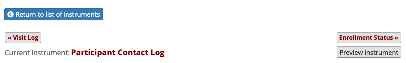

# Designer Prev/Next Buttons
Adds previous and next instrument buttons to online designer. Saves you a click.

## Why?

If you've worked with projects with more than a just a few instruments, you'll appreciate that navigating between them can be a bit of a pain. You have to click the 'Return to list of instruments' button to go back to the designer page and scroll down to the instrument you're interested in. Sometimes you might forget which instrument you were just in, and you might click into the wrong one.

This module allows users to navigate directly from within an instrument to its neighbours, skipping the 'Return to list of instruments' step.

## Setup

Install the module from REDCap module repository and enable over Control Center.

## Usage

Does what it says on the box.

Enabling this module on projects will add a button to take the user to the previous and/or next instrument while on any instrument's designer page, saving the need to navigate back to the list, remember which instrument you came from, and click into the next.

## Changelog

Version | Description
------- | --------------------
v0.9.0  | Beta version for testing.
v1.0.0  | Initial release
